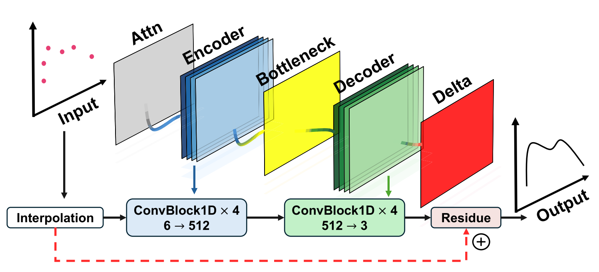
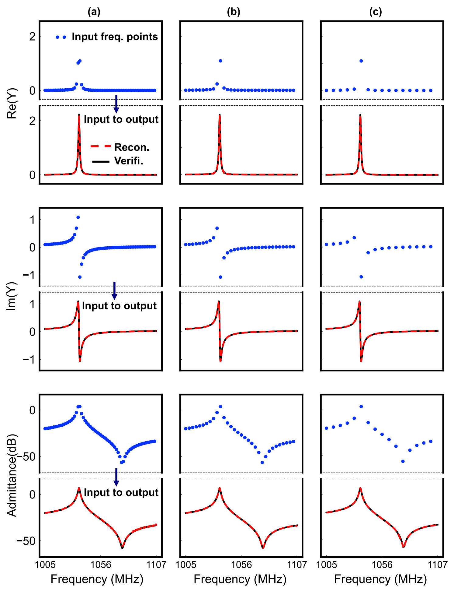

# 只测 16 个频点，如何重建完整的 VNA 频谱响应？

## 从声学谐振器出发，理解 AI 如何将稀疏测量补全为高分辨率频谱

使用矢量网络分析仪（vector network analyzer，VNA）测试器件时，我们通常需要在一段频率范围内逐点扫描。无论是在观察天线的反射、滤波器的传输，还是谐振器的峰谷，读者都会遇到一个共同问题：频率步长越细，越容易看清局部变化；当同样的扫描需要在大量器件上重复时，数据采集的负担也随之增加。

以声表面波（surface acoustic wave，SAW）谐振器为例，从端口测量得到的导纳曲线告诉我们器件在哪里谐振、响应有多尖锐，以及主模附近是否存在杂散响应。VNA 常测量 S 参数，导纳则可在明确端口定义和参考阻抗后由相应参数转换得到。本文讨论的模型重建复导纳谱；天线的 S₁₁、滤波器的 S₂₁ 等响应，是理解测量场景的例子，不能直接套用同一个已训练模型。

一个自然的问题是：如果只测量其中很少的频点，能否利用已经积累的器件知识，恢复其余位置的响应？这篇文章以已发表的 *Toward Intelligent Design and Measurement of MEMS Acoustic Wave Resonators* 为例，解释其中的稀疏频谱重建方法。论文报告：在其 25% 留出测试集上，Masked U-Net-1D 使用 16 个均匀采样频点恢复 1024 点导纳谱，R² 保持在 0.98 以上。本文重点讨论这个结果如何实现，以及应如何理解它的适用范围。[1]

理解这一方法需要同时考虑两类信息：当前器件实际测得的响应，以及模型从训练器件中学到的频谱规律。下面从一条导纳曲线出发，逐步走进网络内部。

**先想象一次具体的扫描。** 假设要观察 2.4–2.6 GHz 的响应，并在两端之间均匀放置 16 个测量点，相邻点间隔约为 13.3 MHz。如果某个峰只有约 1 MHz 宽，它可能落在两个点之间，稀疏扫描便看不清峰形。若在同一范围输出 1024 个均匀网格点，网格间隔约为 0.196 MHz，曲线看起来会细密得多。但新增位置上的数值仍是模型预测，需要验证。这是教学设定；论文的目标网格还涉及后文讨论的特征感知重采样，不能把这里的均匀输出网格当作论文采样细节。日常所说的“恢复连续曲线”，在这里具体指重建高分辨率的离散频谱。

### 1. 为什么少量频点不能直接决定整条曲线

单端口谐振器的复导纳可以写成 Y(f) = G(f) + jB(f)。G 是实部，B 是虚部。把它看作一个随频率变化的电学响应，有助于建立直觉：施加同样的交流电压，器件在不同频率下产生的电流幅值与相位并不相同。谐振附近，这种变化尤其显著。

设想一个教学例子：相邻两个采样点的导纳幅值都很低。连接这两个点，可以得到一条平缓的曲线；但在它们之间，也可能存在一个没有被采到的窄峰。两种曲线都能通过已有观测点。只凭这两个点，无法确定中间到底发生了什么。

把问题具体化：2.48 GHz 和 2.50 GHz 两处的响应都接近背景值。线性插值会把它们连起来；但另一条同样经过这两个点的曲线，可能在 2.49 GHz 附近藏着一个窄峰。即使把这段插值曲线画成一千个点，窄峰也不会因为画得更密而自动出现。AI 的作用，是结合已学到的器件规律，预测这段缺失区域更可能是什么样，而不是把未测过的数值变成新的实测证据。这组频率同样是教学例子。

这也解释了为什么简单增加输出点数并不等于获得新测量。要从稀疏观测恢复细节，必须引入额外约束。对于同一材料体系和相近工艺下的谐振器，大量训练频谱能够提供这些约束：模型可以学习谐振、反谐振以及背景响应之间反复出现的关系。新的稀疏测量则进一步限定当前器件应接近哪一种响应。

因此，16 个频点的意义应放在训练分布中理解。它们与模型学到的先验共同支持重建；对一条任意变化的未知曲线，同样的 16 个点并不保证能够确定全部细节。

### 2. 从通信中的导频，理解少量观测怎样帮助恢复响应

在通信接收机中，我们不仅要接收到信号，还要知道信道怎样改变了它。对于满足循环前缀和同步等条件、可按子载波处理的 OFDM 系统，可以把某个子载波上的关系写成 r[k] = h[k]x[k] + n[k]：x[k] 是发出的符号，r[k] 是收到的符号，h[k] 是复信道增益，n[k] 是噪声。在导频位置，接收机知道 x[k]，于是能够估计 h[k]，再利用信道结构推断其他位置的响应。[2]

**先算一个导频。** 假设发出的已知符号为 x = 1，收到 r = 0.8 + j0.2，暂时忽略噪声，信道估计就是 ĥ = r/x = 0.8 + j0.2。它同时描述幅度和相位变化；如果只保留幅值，就会丢掉接收机进行相位补偿所需的信息。这个例子说明了本文为何需要复数响应，而不只是幅值曲线。

VNA 扫描与导频估计都有一个相似的任务：通过已知激励观察系统响应，再从有限观测估计未知部分。但它们的测量对象和校准方式不同。这里借用通信的思路解释稀疏重建，不能把复信道增益 h[k] 与器件导纳 Y(f) 当作同一个物理量。

少量导频能够支持恢复，依赖于信道在频率上的相关性。多径的时延差会使不同路径的相位随频率变化，并产生峰谷；时延扩展与相干带宽大致呈反比，具体系数取决于定义和信道模型。[3] 相干带宽帮助描述“隔多远的频点仍然相似”，并不是任意间隔内都可以安全插值的保证。器件中尖锐的谐振响应，同样提醒我们关注响应随频率变化的尺度。

**频率间隔也会造成无法区分的响应。** 用一个理想基带纯延时模型 H(f) = exp(−j2πfτ) 做教学示例，f 表示相对于载频的频率偏移。若只在 f = k × 1 MHz（k 为整数）处采样，τ = 0 和 τ = 1 μs 两种响应的样本都等于 1；但在 f = 0.5 MHz 处，前者为 +1，后者为 −1。两条曲线通过所有已测点，却在中间完全不同。没有额外延时范围或其他先验时，仅凭这些样本无法唯一确定它们。这是频率采样中的一个歧义例子，不是论文器件的实测模型。

它也有助于理解 Nyquist–Shannon 采样定理的边界：经典定理是在带限等条件下讨论由样本唯一恢复信号，不能把 VNA 的最高扫频频率直接当成 ADC 所需的采样率。[4] 本文沿频率轴采样系统响应，论文又利用训练分布和谐振先验，因此“16 点恢复 1024 点”应视为指定条件下的学习重建结果，不能据此宣称突破了采样定理。

### 3. 信息论视角：更多输出点，为什么不等于更多测量信息

信息论用熵描述不确定性。对于离散随机变量 Z，熵为 H(Z) = −Σ p(z)log₂p(z)，以 bit 为单位。[5] 为了建立直觉，先把 Z 定义为“候选完整频谱的编号”，而不是直接对连续导纳数值计算熵。

**从八条候选曲线中选择。** 假设测试前有八条等概率的候选频谱，不确定性为 log₂8 = 3 bit。在一个人为构造的无噪声例子中，一次测量结果只能把它们分成四组，每组两条。无论测到哪一组，剩余不确定性都是 log₂2 = 1 bit，因而这次测量平均提供 2 bit 的互信息。这里的 bit 描述候选编号的不确定性，既不是 VNA 的 ADC 位数，也不是某个实测频点固定包含的信息量。

如果同一组内的两条候选曲线只在一个窄峰附近不同，那么到那里补测一次，可能比在两条曲线都很相似的背景区补测更有区分力。这个例子连接了“测多少点”和“测在哪里”两个问题。不过，论文的 16 点实验使用均匀 mask，并未验证上述自适应选点方案。

在模型、采样位置及其他先验固定时，令 O 包含模型收到的全部观测与辅助输入，预测频谱是 O 的处理结果。数据处理不等式告诉我们，处理不能让预测与真实频谱之间的互信息超过这些输入所携带的互信息。[6] 因而，把输出从 16 个位置扩展为 1024 个位置，可以形成更有用的表示与估计，却不会凭空产生新的实测证据。如果两种器件在所有输入上完全无法区分，确定的模型也不能知道当前器件究竟是哪一种。

那么，训练数据怎样发挥作用？可以借助贝叶斯推断来理解：观测前，器件知识给出哪些谱形更可能；观测后，测量进一步调整这些可能性。用 Z 表示未知频谱、O 表示输入，关系可以写成：

p(Z | O) ∝ p(O | Z) × p(Z)后验 ∝ 观测与候选频谱的相容程度 × 观测前的先验

这个关系说明，同样的少量测量，对已有较充分器件知识的人和对完全陌生的器件，会留下不同程度的不确定性。模型从训练数据中学到的规律，可以理解为一种统计先验；论文的网络并不因此自动成为显式计算后验概率的贝叶斯模型，也没有在本文结果中给出校准过的不确定度。

通信中的最小均方误差（MMSE）估计还提供了另一层解释：在给定概率模型下，若评价目标是平均平方误差，最优估计为条件均值 E[Z | O]。[7] 假设两个等可能候选在某个未测频点分别取 0 和 1，平方误差最优的预测便是 0.5，虽然当前器件的真实值未必是 0.5。对峰位存在歧义的多个候选求平均，也可能使预测峰更平缓。这说明平均误差较小并不自动等于局部峰形准确；论文使用的复合损失和观测回填也不能简单等同于上述纯 MMSE 估计。

### 4. 先告诉模型：哪里测过，哪里没有测过

神经网络需要规则的输入张量。论文将已测量的值放回完整频率网格，在未测量位置填零，同时增加一个二值掩码（binary mask）：已观测的位置为 1，未观测的位置为 0。[1, Section II-C]

考虑一个刻意简化的教学例子。这里只展示五个位置的实部数值，任意单位用于说明输入编码，不代表论文中的器件数据：

<table><thead><tr><th>频率位置</th><th>f₁</th><th>f₂</th><th>f₃</th><th>f₄</th><th>f₅</th></tr></thead><tbody><tr><td>测量记录</td><td>0.2</td><td>未测量</td><td>0</td><td>未测量</td><td>0.5</td></tr><tr><td>填零后的输入</td><td>0.2</td><td>0</td><td>0</td><td>0</td><td>0.5</td></tr><tr><td>Mask</td><td>1</td><td>0</td><td>1</td><td>0</td><td>1</td></tr></tbody></table>

如果只有数值通道，f₂ 和 f₃ 看起来完全相同。加上 mask 后，模型能够区分“这里尚未测量”与“这里测得的数值就是零”。对于虚部经过零点的响应，这一区分尤其容易理解。缺失是一种观测状态，零则可能是一个有效的测量结果。

也可以把 mask 理解为测试记录上的“已完成”标记：某个频点尚未测试，它的结果栏暂时留空；另一个频点已经测试，其虚部恰好为零。为了批量输入模型，两栏都填成零，但前者标记为 0，后者标记为 1。这里“数值”和“观测状态”分别回答两个问题：响应是多少，以及这个数值是否来自本次测量。

论文方法还同时使用导纳实部、虚部、dB 幅值、频率编码和谐振区域的 attention prior（注意力先验）。频率编码提供位置信息；谐振先验使网络对关键频段更敏感。它们与 mask 的作用不同：mask 记录观测位置，先验引导模型如何解释响应。[1, Eqs. (13)–(15)]

### 5. 从插值开始，让网络学习需要补上的部分

Masked U-Net-1D 的计算过程可以从论文 Algorithm 1 读出：先由稀疏观测构造插值曲线，再由网络预测修正量，随后将两者相加。最后，在已测量位置回填原始观测值。[1, Algorithm 1]

初始预测 = 插值结果 + 网络学习的修正量最终输出：未测位置采用预测值，已测位置保留观测值

继续使用上一节的例子。f₂ 和 f₄ 没有测量，网络可以在这些位置修正插值结果；f₃ 已测得为零，回填步骤会保留这个观测。这个安排给“哪些值必须忠于测量”提供了明确的实现方式。它也意味着观测中的噪声会随回填保留，因而不能把这一操作理解为自动获得了无噪声的真值。

**把一次修正算出来。** 下表只演示一个响应分量，数值为任意单位，与论文的实测数据无关。未测位置的插值为 0.4，网络给出 +0.3 的修正，于是得到 0.7；已测位置虽然也可能产生修正，但最终输出会回到原始观测值。

<table><thead><tr><th>位置状态</th><th>原始观测</th><th>插值基线</th><th>网络修正</th><th>相加结果</th><th>最终输出</th></tr></thead><tbody><tr><td>未测量</td><td>无</td><td>0.4</td><td>+0.3</td><td>0.7</td><td>0.7</td></tr><tr><td>已测量</td><td>0.5</td><td>0.5</td><td>+0.1</td><td>0.6</td><td>0.5</td></tr></tbody></table>

0.7 是否正确，要在留出的测试器件上与完整参考测量比较，不能由“网络给出了这个值”本身判断。类似地，最终保留 0.5，只能说明结果忠于输入观测，不能排除那次测量本身存在误差。

图 1｜论文原 Fig. 5。插值分支提供初始响应，网络分支学习修正量。原图按完整图形区域提取，保留全部模块、标签与连线；图注改写为中文。来源：Liu et al., IEEE TMTT 74(4), 2026，DOI: 10.1109/TMTT.2025.3649908，CC BY 4.0。

网络内部采用一维 encoder–decoder（编码器—解码器）结构。编码器逐层提取更大频率范围内的特征，形成对整体谱形的描述；解码器逐步恢复频率分辨率。Skip connections（跳跃连接）将相应编码层的特征传给解码层，使局部信息能够参与高分辨率重建。

可以把这个过程理解为观察同一条曲线时切换视野：较大的视野帮助判断整个响应包络，较小的视野帮助定位峰谷附近的变化。多尺度结构让这两种信息在重建中相互配合。这是对网络作用的直观解释，具体效果仍需通过测试集中的预测与参考频谱比较来验证。

### 6. 为什么实部、虚部与 dB 幅值要一起约束

复导纳的几个表示并非相互独立。实部与虚部确定幅值，幅值又可转换成 dB 表示。论文的网络输出这三个通道，并通过复合损失检查它们之间的一致性。[1, Algorithm 1]

用一个简单的复数例子说明这一点：若某个频点的实部为 3、虚部为 4，幅值就应为 5。若模型另一个通道却给出对应幅值 8 的结果，那么这些输出在描述同一个复数时发生了矛盾。这里的数字只是教学例子，与论文的实验数据无关。

Algorithm 1 中的三项损失分别检查：预测实部与虚部是否接近参考值；由预测实部与虚部计算出的 dB 幅值是否接近参考幅值；这个计算出的 dB 幅值是否与网络直接输出的 dB 通道一致。第三项约束尤其值得注意，它比较的是同一预测的两种表示。

从读谱的角度看，实部、虚部和 dB 幅值也提供了互补的观察方式。只看幅值可能遗漏相位相关信息，只看较大幅值的区域则可能忽略较弱响应。联合约束促使模型在不同表示下保持一致，但它本身并不能证明所有物理性质都已被严格满足。

**为什么仅有幅值还不够？** 以两个教学复数 3 + j4 和 3 − j4 为例，它们的幅值都是 5，相位却分别约为 +53.1° 和 −53.1°。只对比幅值曲线，会把这两种不同的响应看成相同；同时对比实部和虚部，才能发现差异。对于习惯在 VNA 上切换幅值与相位显示的读者，这说明模型也需要保留复数信息，而不能只学一条看起来相似的幅值曲线。

### 7. 如何阅读“16 点恢复 1024 点”的实验

论文原 Fig. 15 把 64、32 和 16 个输入频点的重建结果并列展示。每列上方的蓝色散点表示稀疏输入，后续曲线对比重建结果与验证响应；实部、虚部和 dB 幅值分别给出。阅读时可以先观察最右侧的 16 点情形，再与另外两列对照。[1, Section III-C]

图 2｜论文原 Fig. 15。从左到右依次为 64、32、16 个输入频点；各列展示复导纳实部、虚部和 dB 幅值的稀疏输入与重建对比。保留原图全部子图、坐标、曲线和图例，裁去周围正文，图注改写为中文。来源同图 1，CC BY 4.0。窄屏可横向滚动图片，也可点击查看大图。

这一结果最值得观察的是：输入变稀疏后，预测曲线能否仍然定位主要峰谷，并保留其附近的谱形。两条曲线大范围重合，是有用的证据；对谐振器而言，峰位、峰宽以及局部弱响应也值得逐项检查。整体 R² 描述总体拟合程度，无法替代这些局部检查。因此，论文报告的测试集 R² > 0.98，不应被解释为每一个器件、每一个通道或每一个杂散峰都具有相同精度。

例如，假设一次教学测试中，参考峰位是 2.4900 GHz，重建峰位是 2.4902 GHz，二者相差 0.2 MHz。若该峰宽只有 1 MHz，这个偏差已经相当于峰宽的 20%。即使其他频段重合得很好，峰位是否满足任务要求仍需单独判断。这个例子并未给定 R²，也不是论文中某个器件的误差；它说明“整条曲线相似”和“关键局部参数够准”需要分别检查。

实际评估时，可以先看完整曲线，再放大主峰附近，对比峰位、峰宽和峰值；随后检查较弱的峰是否漏检，或是否出现参考测量中没有的峰。用于验收的额外测量点应包含模型未见过的位置，因为已输入的点在回填后本来就会与观测重合，单独检查它们不足以验证缺失区域。

这里还需要区分两种采样操作。论文先讨论将约 26,000 点的高密度频谱压缩为 1024 个代表性频点，在谐振和杂散特征附近保留更密集的信息；这是原 Fig. 14 所说明的特征感知重采样。随后，原 Fig. 15 所对应的稀疏恢复实验使用器件无关的均匀 mask，考察从少量输入恢复完整目标谱的能力。[1, Section III-C]

换句话说，不能把 16 点结果描述为“先看完整曲线，再挑最有利的 16 个点”。同时，论文方法与 Algorithm 1 包含谐振 anchors，因此均匀采样也不等于整个推理过程没有谐振先验。对于进一步复现，先验如何在推理时获得，应与采样位置的选择分别说明。

### 8. 点数减少，如何转化为测量收益

从 1024 点减少到 16 点，输入点数保留了 1.5625%，减少了 98.4375%；论文将其概括为约 98%。这个数值直接说明的是采样密度的变化。[1]

若要估算实际测量时间，还需要考虑仪器设置、稳定等待、数据传输、探针移动等固定开销。一个用于理解的简化模型是：总时间 = 固定开销 + 点数 × 单点耗时。它并非本文论文的计时结果，只用于说明为何点数与总时间不能直接等比例换算。

例如，假设固定开销为 100 ms，每个频点需要 1 ms，1024 点扫描的总时间为 1124 ms，16 点则为 116 ms。在这一假设下，总时间减少约 89.7%，与点数减少约 98.4% 并不相同。实际系统还需要加入模型推理及任何辅助测量的开销，最终收益应在指定仪器配置下计时验证。

若按同一教学假设连续测试 1000 个器件，扫描部分会从约 18 分 44 秒降到约 1 分 56 秒。这只是上述公式的批量换算，尚未计入探针移动、额外校准、模型推理等流程成本。它帮助我们理解为何少量频点在批量测试中有吸引力，也提醒我们最终应统计整批任务的实际耗时，而不只统计频点数。

稀疏重建的工程意义由此更容易把握：当逐点扫描占据较大比例的测试负担时，减少频点具有直接价值；而完整的吞吐量改进，需要把模型放回真实测量流程中评估。

### 9. 从频谱重建回到器件设计

在整篇论文中，稀疏频谱重建是设计与测量框架的一部分。结构参数到性能指标的预测帮助筛选候选器件；sim-to-real（仿真到实测）校正利用有限测量修正仿真偏差；杂散响应的量化则为目标约束下的设计提供依据。[1, Sections II–III]

这些步骤共同指向一个实际目标：让已有器件的知识参与下一次设计与测量。对初学者而言，Masked U-Net-1D 提供了一个具体切入点。它从可解释的插值起步，通过学习修正补全缺失频点，以 mask 保留已有观测，再用不同响应表示之间的一致性约束训练。

这一能力目前应放在论文验证的范围内理解：42°YX LiTaO₃ SAW 器件及其已校准的参数与工艺窗口。换用新的材料堆叠、显著不同的几何结构或训练中少见的响应形态时，需要重新验证模型，并按需要补充数据和进行适配。[1, Section IV]

例如，一个主要见过正常单主峰器件的模型，遇到损伤器件的新杂散峰时，可能倾向于预测训练中更常见的平滑响应。这是迁移到实际测试时应检查的假设场景，并非论文报告的失效案例。如果测试目标恰好是发现异常，就需要把这类器件纳入独立验证，检验模型是否会漏掉新的特征。将方法用于滤波器、天线或其他 VNA 测试对象时，也需要重新确定输出参数、训练数据、频率网格和局部验收指标。

学习这个例子，最终需要掌握的是测量与先验之间的分工：稀疏测量约束当前器件，训练数据提供可复用的规律，实验验证决定这些规律在什么范围内可信。理解这三者的关系，才能判断类似方法是否适合自己的器件与测量任务。

### 参考文献与图像来源

[1] X. Liu, T. Meng, S. Chen, T. H. Yang, J. Zhang, S. Gong, and Y. Yang, “Toward Intelligent Design and Measurement of MEMS Acoustic Wave Resonators,” *IEEE Transactions on Microwave Theory and Techniques*, vol. 74, no. 4, pp. 3478–3490, Apr. 2026. [DOI: 10.1109/TMTT.2025.3649908](https://doi.org/10.1109/TMTT.2025.3649908)。[IEEE 论文页面](https://ieeexplore.ieee.org/document/11333585)。

[2] D. Tse and P. Viswanath, *Fundamentals of Wireless Communication*, Cambridge University Press, 2005，[Chapter 3：OFDM 与信道估计](https://web.stanford.edu/~dntse/Chapters_PDF/Fundamentals_Wireless_Communication_chapter3.pdf)。

[3] 同上，[Chapter 2, Section 2.3.2：时延扩展与相干带宽](https://web.stanford.edu/~dntse/Chapters_PDF/Fundamentals_Wireless_Communication_chapter2.pdf)。

[4] MIT 6.003, *Signals and Systems*, Fall 2011，[Lecture 21：Sampling](https://ocw.mit.edu/courses/6-003-signals-and-systems-fall-2011/12e6e5d7567fca2e993ef8563fef5a60_MIT6_003F11_lec21.pdf)。

[5] M. Médard, MIT 6.441, *Information Theory*, Spring 2010，[Lecture 1：熵与互信息](https://ocw.mit.edu/courses/6-441-information-theory-spring-2010/aa7737b3645178c0b746a57f1bdff2cd_MIT6_441S10_lec01.pdf)。

[6] 同上，[Lecture 2：数据处理不等式](https://ocw.mit.edu/courses/6-441-information-theory-spring-2010/5c0b5a8a544cb2320778e4c9e5dea64f_MIT6_441S10_lec02.pdf)。

[7] D. Tse and P. Viswanath, *Fundamentals of Wireless Communication*，[Appendix A, Section A.3：MMSE 与条件均值](https://web.stanford.edu/~dntse/Chapters_PDF/Fundamentals_Wireless_Communication_AppendixA.pdf)。

论文标注 © 2026 The Authors，采用 [Creative Commons Attribution 4.0 International](https://creativecommons.org/licenses/by/4.0/) 许可。本文使用原 Fig. 5 与 Fig. 15，提取图形区域并另写中文图注，未更改图内科学内容。文中的扫描网格、漏峰、导频、纯延时歧义、候选频谱与熵、MMSE、mask、残差修正、复数幅值与相位、峰位误差、批量计时及异常器件场景均为教学构造，不是论文新增实验。通信与信息论内容用于解释方法及其边界，不构成该网络的可恢复性证明。
